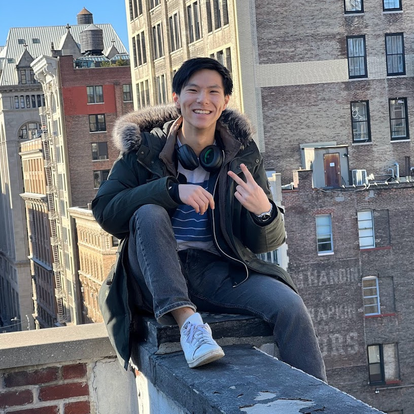

  

    
  

### Currently I am...
- Trying to learn short films and cinematography
- 24 hours of lemons racing
- working on beaming [4G LTE from Space](https://www.starlink.com/us/business/direct-to-cell) via Starlink

### Previously
- scaled rooftops
- lead the [PAN](https://www.spacecraftresearch.com/pan) team that deployed two satellites into space 
- built camera systems for [Orchard Robotics](https://www.orchard-robotics.com/)
- founded and lead an [autonmous plane team](https://www.tjuav.org/)
- co-director for [Big Red Hacks @ Cornell](https://www.bigredhacks.com/)

### For fun I...
- longboard
- take [photos](photos)
- designed my own [remote-control F-86 - plans here!](f86)
- built a 7' 7" [tower of cards](tower-of-cards)
- painted a [wolf longboard](wolfe)
- animated a [visual mix](listen-to-the-line)

### These made me smile...
- [Children in the Dark](https://www.youtube.com/watch?v=TsWiuqzhtis)
- The Three Body book series - Cixin Liu
- Foundation - Isaac Asimov
- All the Light We Cannot See - Anthony Doerr

### Notes
Here are some of my favorite notes:
- [[seeking-epilogue]]
- [[the-clockmaker]]